# QuantumLab - Architectural Diagrams (Mermaid)

Visualizaciones gráficas de la arquitectura del sistema.

---

## 1. Diagrama General de Capas

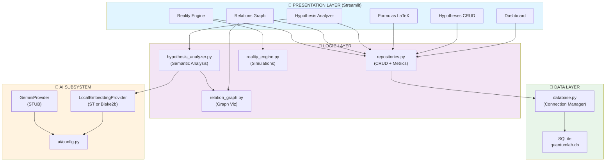

---

## 2. Dependency Graph (Módulos Core)

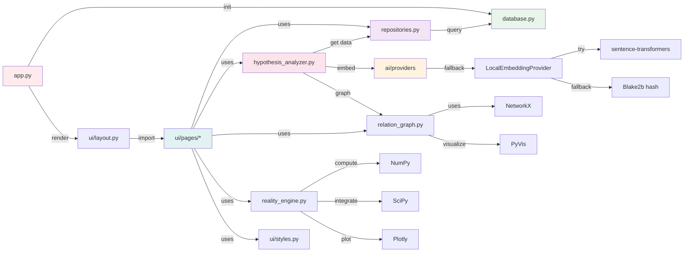

---

## 3. Data Flow: Create Hypothesis

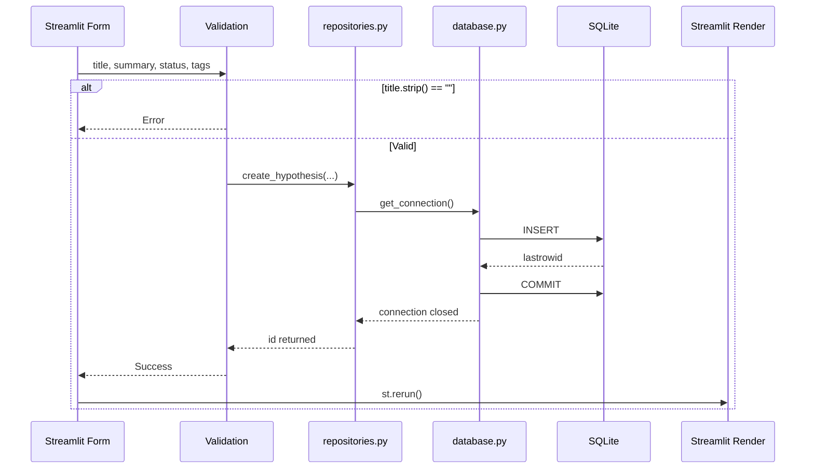

---

## 4. Data Flow: Hypothesis Analyzer

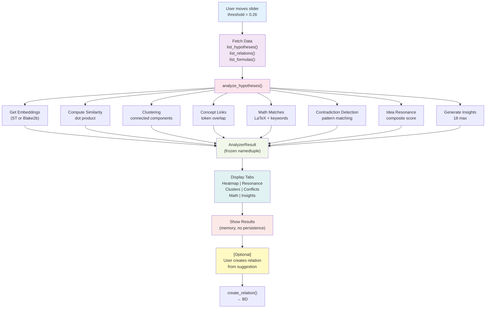

---

## 5. Database Schema Relationships

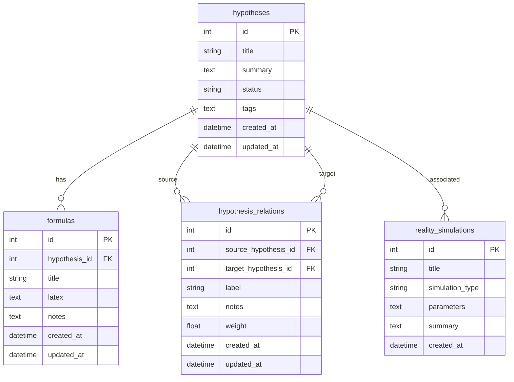

---

## 6. Module Dependency Matrix

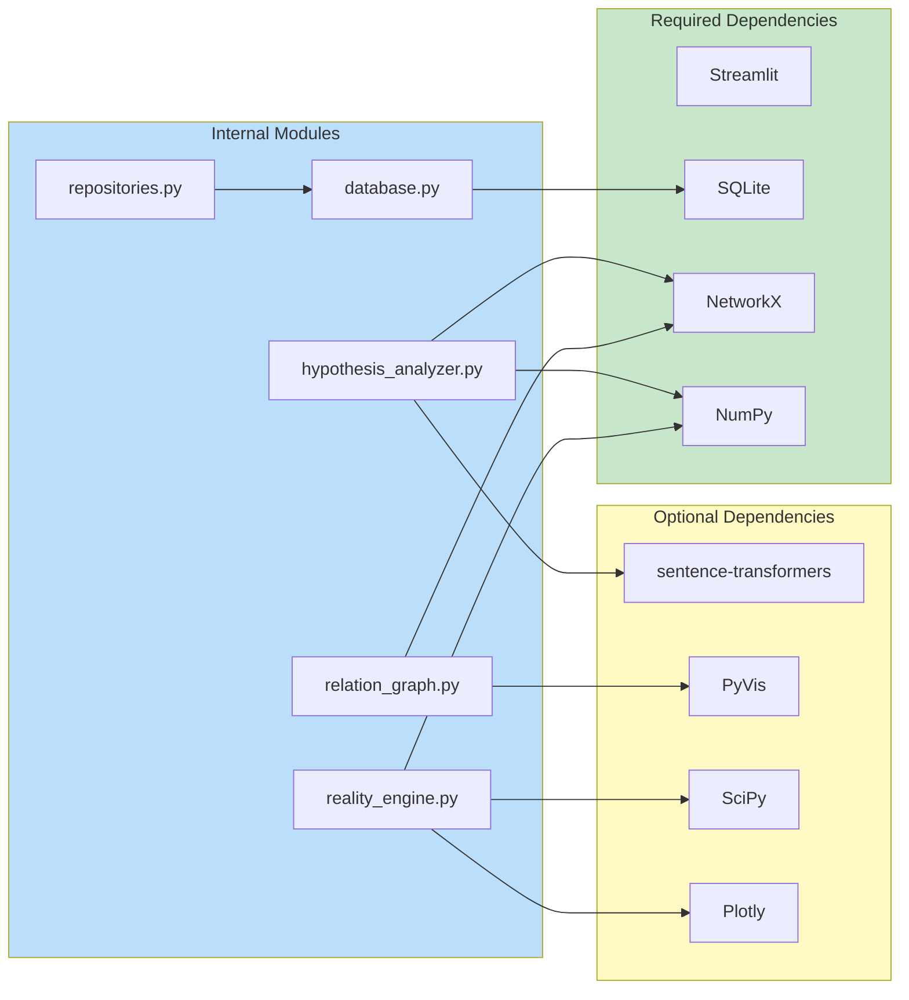

---

## 7. Risk Heatmap (Severity vs Probability)

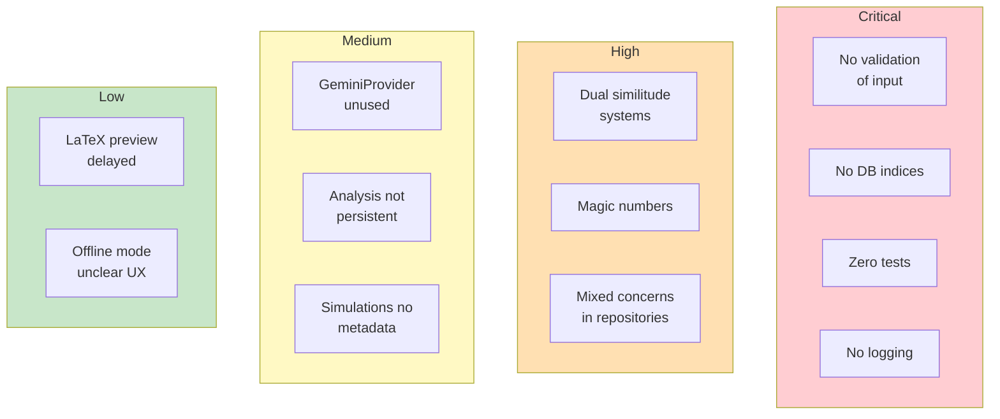

---

## 8. UI Navigation Graph

```mermaid
graph TB
    Sidebar["Sidebar<br/>st.radio"]
    
    Sidebar -->|"Panel"| Dashboard["render_dashboard()"]
    Sidebar -->|"Hipotesis"| Hypotheses["render_hypotheses()"]
    Sidebar -->|"Formulas"| Formulas["render_formulas()"]
    Sidebar -->|"Hypothesis Analyzer"| Analyzer["render_hypothesis_analyzer()"]
    Sidebar -->|"Relaciones"| Relations["render_relations()"]
    Sidebar -->|"Reality Engine"| Reality["render_reality_engine()"]
    
    Dashboard --> Metrics["5 Metrics"]
    Dashboard --> Recent["Recent Hypotheses<br/>& Formulas"]
    
    Hypotheses --> Create["Create Form"]
    Hypotheses --> List["List with Expanders"]
    Create --> CRUD1["CRUD Operations"]
    
    Formulas --> Create2["Create Form"]
    Formulas --> List2["Library"]
    Create2 --> CRUD2["CRUD Operations"]
    
    Analyzer --> Tabs1["5 Tabs"]
    Tabs1 --> Tab1["Visual Overview"]
    Tabs1 --> Tab2["Insights"]
    Tabs1 --> Tab3["Consistency"]
    Tabs1 --> Tab4["Math"]
    Tabs1 --> Tab5["Clusters"]
    
    Relations --> Manual["Manual Connection"]
    Relations --> Suggestions["Auto Suggestions"]
    Relations --> Graph["Interactive Graph"]
    Relations --> Clusters["Cluster Summary"]
    
    Reality --> Particles["Particles"]
    Reality --> Info["Information Field"]
    Reality --> Dynamics["Dynamics"]
    Reality --> Sandbox["Sandbox"]
    Reality --> Saved["Saved Simulations"]
    
    style Sidebar fill:#e1f5ff
    style Dashboard fill:#f1f8e9
    style Hypotheses fill:#f3e5f5
    style Analyzer fill:#fce4ec
    style Reality fill:#fff3e0
```

---

## 9. Analysis Pipeline Detail

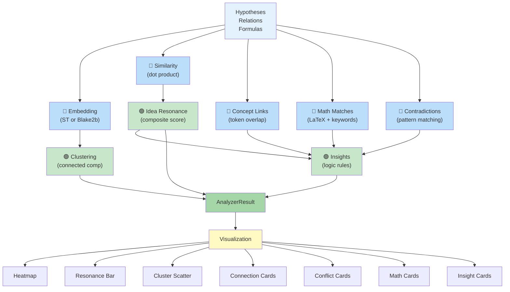

---

## 10. Reality Engine Simulation Types

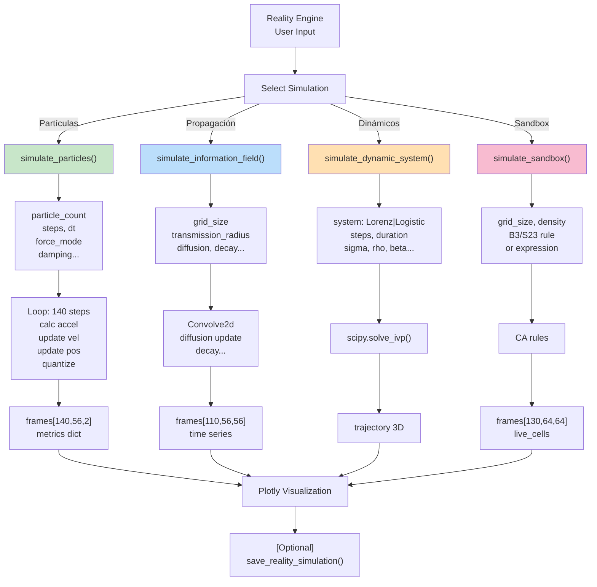

---

## 11. Error Handling & Validation Layers

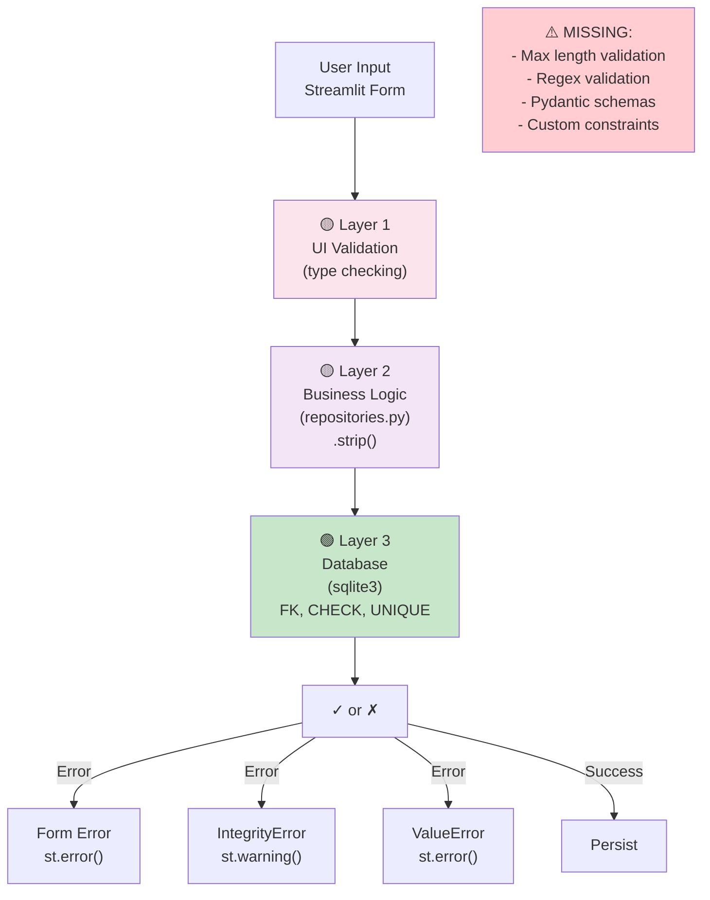

---

## 12. Improvement Roadmap (Phases)

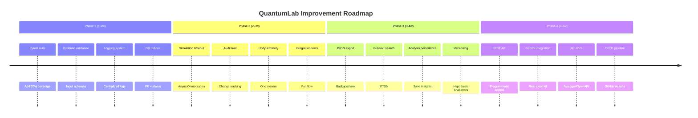

---

**Diagramas generados con Mermaid**  
**Copiar bloques a tu herramienta favorita de visualización si necesario**

Referencia: https://mermaid.live/
